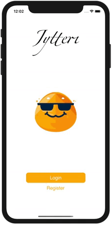

# Jytteri

<br />
    <p align="center">
        
    </p>
<br/>

## Table of Contents

* [About Jytteri](#about-Jytteri)
  * [Built With](#built-with)
* [Getting Started](#getting-started)
  * [Prerequisites](#prerequisites)
  * [Installation](#installation)
* [License](#license)

## About Jytteri

Jytteri is a mobile application which displays different events happening around the world. This project was inspired when many students at University of Ottawa wern't notified with parties that are happening near the university. Since I wanted to include and connect everyone together, I decided to tackle this problem by building a mobile application.

### Built With

* [React Native](https://reactnative.dev/) - mobile framework
* [Redux](https://redux.js.org/) - library for managing global state application
* [Flask](https://flask.palletsprojects.com/en/1.1.x/) - Backend framework
* [MySQL](https://www.mysql.com/) - RDMS
* [Google Maps API](https://developers.google.com/maps/documentation) - Map API

## Getting Started

### Prerequisites

* npm
```sh
npm install npm@latest -g
```

### Installation

To get the frontend running locally:

- Clone this repo
- navigate to `/frontend` directory
- `npm install` to install all required dependencies 
- `npx react-native run-ios` or `npx react-native run-ios` depending on the device to start the local server mobile application


To get the backend running locally:

- Clone this repo
- navigate to `/backend` directory
- Create your own local flask env
- `python server.py` to run the flask server

Database:
- clone this repo
- navigate to `/database` directory
- Create all the tables that is inside `createdb.sql`

NOTE: This application will not run locally unless:
1. You will need to set up a local MySQL DB and connect it to the `./backend/app.js`.
2. It is required to obtain Google Maps API Key. You can request your API key [here](https://developers.google.com/maps/documentation/javascript/get-api-key) 


## Authors

* **James Lee** - *Developer* - [printBart](https://github.com/printbart)

For more information, visit [my website](https://jameslee.tech/#/projects)